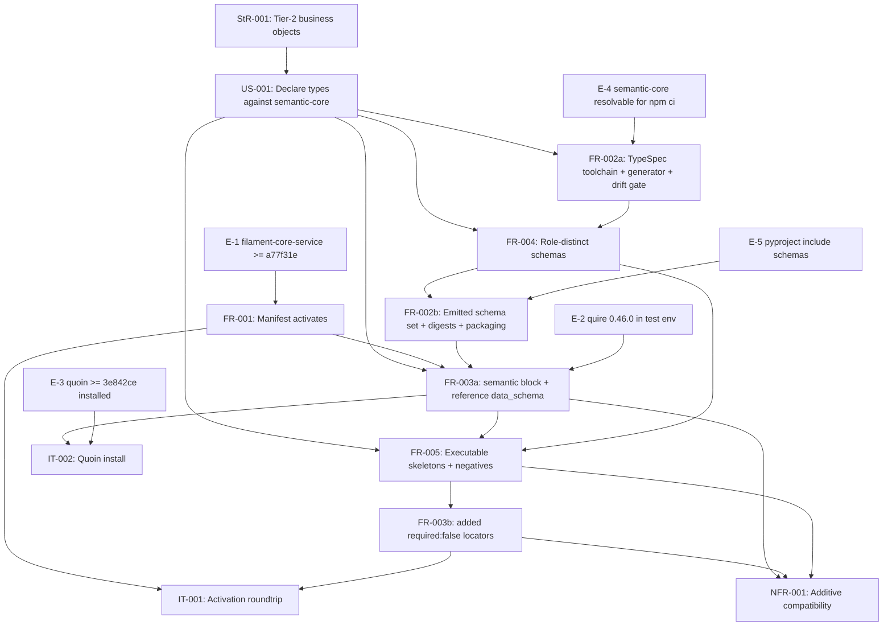

# SR-004: Dependency review of issue #4 semantic data schemas

## Summary

Dependency and ordering analysis of the issue #4 spec set (StR-001, US-001,
FR-001..FR-005, NFR-001, IT-001, IT-002, TM-001) with every named external
dependency verified read-only on 2026-09-03. Every external artifact the spec
names exists and is at the stated version (`@agent-ix/semantic-core` 0.1.0 on
npm.ix and in `node_modules`; TypeSpec compiler and emitter 1.15.0 pinned and
locked; quoin main HEAD is `3e842ce` with FR-070..FR-075; quire-rs main HEAD is
`17b80e4` with FR-069..FR-072; the installed Python wheel is quire 0.46.0 with
`extract_semantic`, `validate_document`, `Registry.load_from`; the
module-manifest schema carries the `semantic` block and the `data_schema`
reference form; every diagnostic code FR-005 relies on is emitted by quire).
The problems are not missing artifacts but unreleased and unprovisioned ones:
three of the four upstream engines the feature work depends on exist only on
an untagged `main`, the manifest change in FR-003 is rejected by every released
filament-core-service, and the quire wheel the whole test matrix rests on is
invisible to the module's own Python environment. Two ordering cycles inside
the FR set (FR-002 with FR-004, FR-003 with FR-005) must be broken before
`spec-to-plan` can sequence the work.

## Verdict

**Not ready for `spec-to-plan` as written.** Two highs (FND-140, FND-141) are
enablement gaps the spec does not state; two mediums (FND-144, FND-145) are
ordering cycles that make the stated `depends_on` edges unsatisfiable as a
DAG. The remaining mediums are untracked enablement steps that a plan must
carry as explicit tasks. Once FND-144/FND-145 are resolved by the splits
proposed below, the topological order in this document is the sequence to
plan against.

## Findings

| ID | Severity | Summary | Refs | Escape Cause |
|----|----------|---------|------|--------------|
| FND-140 | high | FR-003 adds a top-level `semantic` key, but the module-manifest schema is `additionalProperties: false` at the top level and no released filament-core-service contains the schema commit `a77f31e` that admits it (latest tag v0.8.34; `git tag --contains a77f31e` is empty). Every released service rejects the 0.3.0 manifest, so FR-001-AC-1/AC-2 and IT-001 can pass only against an unreleased main build. The spec pins FR-035 by name only, never by revision or release, and lists only Quoin and Quire as consumers of the block. | FR-001, FR-003, IT-001, spec.md | missing-requirement |
| FND-141 | high | Quire 0.46.0 is not provisioned anywhere the module's tests run: it is not a dependency in `pyproject.toml` (the existing test file says "quire is intentionally NOT a dependency"), pypi.ix serves quire 0.3.6 at most, no quire-rs tag contains `17b80e4` (latest v0.45.0), and the only 0.46.0 wheel lives in a Python 3.10 user site while the module's poetry env is Python 3.13 (`poetry run python -c "import quire"` fails). FR-005's skip clause then turns TC-024..TC-026, TC-031..TC-039, TC-041, TC-050..TC-054, TC-057, TC-061..TC-063 (24 rows, every semantic row in the matrix) into silent skips. | FR-003-AC-4, FR-004, FR-005, NFR-001, tests.md | missing-requirement |
| FND-142 | medium | Quoin at or after `3e842ce` is unreleased: no tag contains it (latest v0.23.1) and the globally installed quoin 0.23.1 has no semantic module (its `dist/` contains no `package-manifest` code). IT-002's precondition "`make build && npm i -g .` from /home/peter/dev/quoin" is an untracked enablement step on one developer machine, and FR-003-AC-5 / TC-027 / TC-070 are Manual/Demonstration against that build. | FR-003-AC-5, IT-002, tests.md | correct-requirement-no-evidence |
| FND-143 | medium | `package-lock.json` resolves `@agent-ix/semantic-core@0.1.0` to `http://npm.ix/...`; the package is not on public npm (filament-core-data#11 is OPEN) and FR-002-CON-2 forbids a repo `.npmrc`. `npm ci`, `make schemas`, and `make schemas-check` therefore cannot run in the GitHub publish workflow; the FR-002 drift gate is local-only until #11 lands or the lockfile discipline is stated. | FR-002, FR-002-CON-2, spec.md | missing-requirement |
| FND-144 | medium | FR-002 and FR-004 are cyclic in substance. FR-004 `depends_on` FR-002, but FR-002-AC-1 asserts the emitted set equals "the ten object-type models plus the support models the source declares", FR-002-AC-3 checks their `$ref`s, and FR-003 consumes their digests: none of these can be satisfied before the FR-004 models exist in `typespec/main.tsp`. Both FRs describe one TypeSpec source. Split FR-002 into toolchain/generator/drift-gate (AC-4, AC-5, CON-1..3: enablement, first) and emitted-set (AC-1, AC-2, AC-3, AC-6: after FR-004), or reverse the edge and mark FR-002 as verified after FR-004. | FR-002, FR-004 | wrong-requirement |
| FND-145 | medium | FR-003 and FR-005 are cyclic. FR-005 `depends_on` FR-003, but FR-003 Behavior ("Where a skeleton gains a `## Properties`, `## Invariants`, or `## Operations` section (FR-005), the object type SHALL gain a matching `required: false` locator"), FR-003-AC-3 and FR-003-CON-2 depend on the FR-005 skeleton content, and FR-003-AC-4 validates the FR-005 skeletons. Move the added-locator clause and CON-2 into FR-005 (the skeleton and its locator land together) or split FR-003 into contract block + digests (enablement, before FR-004/FR-005) and locator additions (after FR-005). | FR-003, FR-005, NFR-001 | wrong-requirement |
| FND-146 | medium | The manifest-schema copy that Quoin and Quire vendor (`sha256:69cf9738...`, from filament-core-service `a77f31e`) is what FR-003-AC-6, TC-001 and TC-026 validate against, while IT-001 validates against the running service. The spec never states that the two must be the same revision; after FND-140 is resolved the plan needs one pinned filament-core-service revision for FR-035 used by all three consumers. | FR-001-AC-1, FR-003, IT-001, IT-002 | missing-requirement |
| FND-147 | low | `mappings: [typed-table, sysml-fence, ocl-clause]` in FR-003 are free strings in the manifest schema (`items: string, minLength 1`); quoin source uses those tokens only as sweep form names, and neither Quoin nor Quire validates mapping names against a registry. FR-003-AC-1 therefore checks the manifest against itself for this key; the dependency on "quoin FR-071..073 mapping names" has no enforcing consumer. | FR-003-AC-1 | correct-requirement-no-evidence |
| FND-148 | low | spec.md References cite filament-core-data "ADR-0005 (TypeSpec source)"; no `ADR-0005*` file exists in filament-core-data (only log.md and index.md mention the decision). The dependency resolves to a decision record that was never written. | spec.md, FR-002 | wrong-requirement |
| FND-149 | low | Packaging enablement is spread across FR-002 Behavior without a task-shaped home: `pyproject.toml` `include` lists only `manifest.yaml` and `skeletons/*.md` (no `schemas/*.json`), and `package.json` `files` already lists `schemas/` while the directory does not exist yet. Both must change for FR-002-AC-6 and the npm tarball; the plan should carry them as one packaging task under the toolchain enablement, not under the schema feature. | FR-002-AC-6, FR-002 Behavior | missing-requirement |
| FND-150 | low | FR-005 names eight negative cases by reason but not by diagnostic code; the codes quire 0.46.0 actually emits are `semantic.record-invalid` (schema refusals), `semantic.properties-both-forms`, `semantic.dangling-clause-ref`, `semantic.invalid-type-token`, and `semantic.legacy-properties-form`. The `expect:` values the fixtures will carry are a dependency on quire's code vocabulary that the spec leaves implicit. | FR-005-AC-5, NFR-001 | correct-requirement-no-evidence |

## External Dependency Verification

Read-only checks performed on 2026-09-03. "Stated" is what the spec names;
"Found" is what exists.

| Dependency | Stated | Found | Status |
|---|---|---|---|
| `@agent-ix/semantic-core` | 0.1.0 on npm.ix | `npm view` on npm.ix: 0.1.0, only version, published 2026-09-03; `node_modules/@agent-ix/semantic-core` 0.1.0; lockfile resolves to `http://npm.ix/` tarball; models `FieldDecl`, `TypeRef`, `Multiplicity`, `ConstraintDecl`, `RelationDecl`, `OperationDecl`, `ClauseRef`, `EnumValue`, `KernelScalar` (incl. `Timestamp`), `Identifier`, `SemanticId` all declared in `main.tsp`; `$id` base `https://schemas.agent-ix.org/semantic-core/0.1.0/` | exists, correct version; local-registry only (FND-143) |
| TypeSpec toolchain | `@typespec/compiler` 1.15.0, `@typespec/json-schema` 1.15.0 | exact devDependencies, locked to registry.npmjs.org 1.15.0; semantic-core peerDependencies are the same exact versions; `tsp --version` 1.15.0 | exists, correct version |
| quoin | main at/after `3e842ce`, FR-070..FR-075 | main HEAD is `3e842ce`; FR-070..FR-075 present; `src/semantic/package-manifest.ts` writes `<root>/semantic/package-manifest.json`; `src/semantic/schemas/filament-core-data/package-manifest.schema.json` vendored | exists on main; no tag contains it, installed CLI is 0.23.1 without it (FND-142) |
| quire-rs | main, FR-069..FR-072; wheel 0.46.0 with `extract_semantic` | main HEAD `17b80e4` (#388); FR-069..FR-072 present; Cargo version 0.46.0; Python surface exposes `extract_semantic`, `validate_document`, `validate_manifest`, `Registry.load_from`; diagnostic codes `semantic.record-invalid`, `semantic.unresolved-type`, `semantic.legacy-properties-form`, `semantic.properties-both-forms`, `semantic.dangling-clause-ref`, `semantic.unknown-key` present | exists on main; untagged, not on pypi.ix, not in the module's poetry env (FND-141) |
| module-manifest schema (FR-035) | "with the `semantic` block" | filament-core-service `origin/main` `a77f31e` (#22, merged) carries the block; quoin and quire vendor byte-identical copies (`sha256:69cf9738...`); `semantic` requires `contract_version`, `semantic_core`, `package`, admits the nine FR-003 keys plus `sweep_report`, `additionalProperties: false`; top level `additionalProperties: false` | exists on main; no release contains it (FND-140, FND-146) |
| filament-core-service FR-026, FR-034, FR-035 | referenced by FR-001 | all three files present in `spec/functional/` | exists |
| filament-core-data FR-031..FR-034, NFR-014 | referenced by spec.md, FR-002, FR-004 | all present | exists |
| filament-core-data ADR-0005 | referenced by spec.md | no file; decision recorded only in log.md/index.md | missing (FND-148) |
| GitHub issues quoin#291, filament-core-data#11, #34, #35, #36, quire-contract-ir#52, filament-core-service#21 | referenced as boundaries | all exist; #34, #35, #21 CLOSED; #291, #11, #36, #52 OPEN | exists |

## Classification

| Requirement | Class | Rationale |
|-------------|-------|-----------|
| StR-001 | Feature (root need) | Stakeholder need; no implementation of its own |
| US-001 | Feature (root story) | Maintainer story realised by FR-002..FR-005 |
| FR-001 | Enablement | Manifest activation against filament-core; already satisfied at 0.2.0, prerequisite for every manifest change |
| FR-002 | Enablement | TypeSpec toolchain, generator, drift gate, packaging of `schemas/`; no business-visible behaviour of its own |
| FR-003 | Enablement | Manifest `semantic` block, reference-form `data_schema`, locator preservation; a contract, not a behaviour authors see |
| FR-004 | Feature | The role-distinct schemas are what authors, reviewers, and downstream frontends consume |
| FR-005 | Feature | Executable skeletons and negative fixtures are the module's user-visible authoring contract |
| NFR-001 | Constraint | Additive-compatibility bound on FR-003 and FR-005; verified by its own tests, implements nothing |
| IT-001 | Verification | Verifies FR-001 against a running filament-core-service |
| IT-002 | Verification | Verifies FR-003 against a Quoin built from main |

Enablement outside the FR set that the plan must carry as explicit tasks
(none has a requirement of its own today):

1. E-1 filament-core-service released or deployed at/after `a77f31e` (FND-140, FND-146).
2. E-2 quire 0.46.0 wheel reachable from the module's Python 3.13 environment, or the skip clause replaced by a hard dependency (FND-141).
3. E-3 quoin built and installed from main at/after `3e842ce` (FND-142).
4. E-4 semantic-core resolvable where `npm ci` runs, or the CI scope of FR-002's drift gate stated (FND-143).
5. E-5 packaging: `pyproject.toml` include for `schemas/*.json`; `package.json` `files` already correct (FND-149).

## Dependency Graph

Edges are the explicit prerequisites the spec states, after the two splits
proposed in FND-144 and FND-145 (FR-002a toolchain, FR-002b emitted set;
FR-003a contract block and digests, FR-003b added locators). External
prerequisites are shown as the enablement items E-1..E-5.

External prerequisites by requirement (each is a hard edge; the artifact is
listed under FND-140..FND-143 where it is not yet released or provisioned):

| Requirement | External prerequisite |
|---|---|
| FR-001 | filament-core-service FR-035 (schema at `a77f31e` once FR-003 lands), FR-026, FR-034 |
| FR-002 | semantic-core 0.1.0 (filament-core-data FR-031, FR-033); TypeSpec 1.15.0 |
| FR-003 | quoin FR-070, FR-073; quire-rs FR-069; module-manifest schema with `semantic` block |
| FR-004 | semantic-core 0.1.0 grammar (filament-core-data FR-031, NFR-014); quire-rs FR-070, FR-071 record shape |
| FR-005 | quoin FR-071, FR-072; quire-rs FR-070, FR-071, FR-072; quire wheel 0.46.0 |
| NFR-001 | quoin FR-074 |
| IT-002 | quoin FR-070, FR-073, FR-075 built from main |

## Topological Order (suggested implementation sequence)

1. Enablement, parallelizable: E-4 (semantic-core reachable for `npm ci`), E-5 (packaging include), E-2 (quire wheel in the test env), E-3 (quoin from main), E-1 (filament-core-service at/after `a77f31e`).
2. FR-002a: TypeSpec toolchain, generator, `$id` normalization, drift gate (`make schemas`, `make schemas-check`), determinism test.
3. FR-004: the ten object-type models and six support models in `typespec/main.tsp`; schema-level positive/negative record tests (TC-030..TC-041).
4. FR-002b: emitted set, `toolchain.json`, digests, wheel and npm inclusion (TC-010..TC-016).
5. FR-003a: manifest `version: 0.3.0`, `semantic` block, reference-form `data_schema`, loader tests (TC-020..TC-022, TC-024, TC-026).
6. FR-005: skeleton rewrite, alternate `sysml` skeletons, negative fixtures (TC-050..TC-057).
7. FR-003b: added `required: false` locators for the sections FR-005 introduced (TC-023, TC-025).
8. NFR-001 verification (TC-060..TC-063); IT-002 demonstration (TC-027, TC-070); IT-001 re-run against E-1 (TC-001..TC-004).

FR-004 and FR-002a can proceed concurrently once the toolchain compiles a
stub-free source; nothing else in the feature layer is parallel because every
later step consumes the previous step's bytes (digests, locators, skeletons).

## Cycles

Two cycles in the stated edges, both broken by the splits above:

- FR-002 → FR-004 → FR-002 (FND-144): FR-004 `depends_on` FR-002 while FR-002-AC-1/AC-3 and the FR-003 digests require the FR-004 models.
- FR-003 → FR-005 → FR-003 (FND-145): FR-005 `depends_on` FR-003 while FR-003 Behavior, AC-3, AC-4, and CON-2 require the FR-005 skeletons.

No cycle remains in the graph drawn above.

## Dispositions

Applied on the review-fix round for `agent-ix/spec-objects-business#4`; the
findings table above is unchanged.

| Finding | Disposition |
|---|---|
| FND-140 | Applied: FR-001 Behavior and IT-001 Preconditions pin filament-core-service revision `a77f31e` (CR-003); `spec.md` records the reference-form resolution gap as `agent-ix/filament-core-service#23`. |
| FND-141 | Applied: FR-005 replaces the skip clause with a hard failure naming the missing function, a new `make dev-quire` provisioning target, and `agent-ix/quire-rs#392`. Provisioning as a *committed* dependency is genuinely impossible from this repo — `internal-pypi` (the index this repo's CI uses) serves quire 0.33.0 at most, no `quire-rs` tag carries the semantic layer, and committing a `local-pypi`/`pypi.ix` source ref is forbidden — so `agent-ix/quire-rs#392` was filed to publish the 0.46.0 wheel, and it is named in `spec.md` Out of Scope, FR-005 Behavior and Dependencies, and the `tests.md` Test Environment section. No matrix row is a silent skip: the suite fails when `extract_semantic` is absent, and TC-061 is the one named expected failure (quire-rs#391). |
| FND-142 | Applied: IT-002 Preconditions state the Quoin build without a developer path and record that no release tag carries the semantic installer; TC-070's status column names the requirement. |
| FND-143 | Applied: FR-002-CON-4 states the lockfile discipline and the local-only scope of the drift gate; TC-019 verifies it. |
| FND-144 | Applied: the FR-002 → FR-004 edge is reversed (FR-002 `depends_on` FR-004; FR-004 lists FR-002 as its build). No cycle remains. |
| FND-145 | Applied: the added-locator clause moved from FR-003 Behavior into FR-005 Behavior; FR-003 keeps only the version-agnostic rule that a post-0.2.0 locator is `required: false`. |
| FND-146 | Applied: FR-003 Inputs pin the same `a77f31e` revision FR-001 names and state that a consumer vendoring an older copy is that consumer's skew defect. |
| FND-147 | Recorded, no change. The three mapping names describe the Markdown authoring mappings this module's fixtures exercise; the manifest schema admits any string and no registry exists to check them against, which is what this finding says. FR-003-AC-1 is honest about checking the manifest against the spec, not against a registry. |
| FND-148 | Recorded, no change. `spec.md` References cite the decision, not a file path; the ADR is filament-core-data's to write and no requirement here depends on its existence. |
| FND-149 | Applied at the plan level: the packaging changes (`pyproject.toml` include for `schemas/*.json`, `package.json` `files`) are FR-002 Behavior obligations with FR-002-AC-6 and the new FR-002-AC-7 over the npm tarball; the plan carries them as one packaging task. |
| FND-150 | Applied: FR-005 Behavior now names the `expect:` diagnostic code for each of the eight negative fixtures. |
