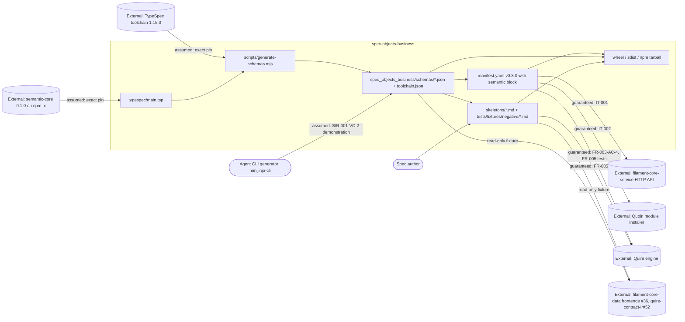

# SR-007: Scope and boundary review of the #4 semantic data schemas spec

## Summary

This analysis drew the boundary of `spec-objects-business` as specified on
`spec/4-semantic-data-schemas`, allocated every StR/US/FR/NFR/IT to an owning
component and responsibility class, and checked each responsibility the spec
claims, disclaims, or relies on against the neighbouring owners: quoin
FR-070..FR-075 (install-time rejection, mappings, digest verification, legacy
forms, package-manifest derivation), quire-rs FR-069..FR-072 (load-time
contract, extraction, record surface), filament-core-data FR-031..FR-034
(semantic-core grammar, JSON Schema projection, IR lowering) and
filament-core-service FR-035 (module-manifest schema), plus GitHub issue
agent-ix/spec-objects-business#4. The boundary is drawn correctly in the
large: the module owns its TypeSpec source, the emitted schemas, the manifest
`semantic` block, and the skeleton fixtures, and it does not re-specify
extraction, install-time rejection, or lowering. Eleven findings: six medium,
five low, no high. The mediums are two responsibilities the spec hands to
neighbours who have not claimed them (extraction of the extra record keys;
generated-language fixtures), one form conflict with the mapping owner
(enumeration `## Values`), one diagnostic code the module relies on that no
neighbour requirement names (`semantic.record-invalid`), one set of negative
fixtures that re-verifies the engine rather than the schemas, and one
under-pinned dependency on the manifest-schema owner.

## Verdict

**Conditional pass.** The in/out-of-scope split in `spec/spec.md` is sound and
no requirement in FR-001..FR-005 duplicates a quoin, quire-rs, or
filament-core-data responsibility outright. Before tasking, the six medium
findings need a disposition: FND-200 and FND-201 need a real owner named (a
ticket, not a repository), FND-202 needs the enumeration skeleton aligned to
the quoin FR-071 form or a quoin change filed, FND-205 needs the
`semantic.record-invalid` contract pinned on the quire-rs side, FND-203 needs
the engine-owned negatives reclassified as contract checks, and FND-210 needs
the FR-035 revision pinned. None of these change the module's boundary; they
close gaps at its edges.

## System Context

## In-Scope Responsibilities

What the module guarantees (spec.md In Scope, FR-001..FR-005, NFR-001):

- Publish `manifest.yaml` conforming to filament-core-service FR-035 and
  activating idempotently against `POST /api/v1/modules/activate` (FR-001).
- Author one TypeSpec model per business object type importing
  `@agent-ix/semantic-core` 0.1.0, and emit one JSON Schema 2020-12 file per
  model with the official emitter at a pinned toolchain, with `$id`, `$ref`,
  determinism and drift-check rules (FR-002).
- Carry the quoin FR-070 `semantic` block and reference-form `data_schema`
  (path + SHA-256) for all ten exported object types at manifest version
  0.3.0, keeping every 0.2.0 locator unchanged (FR-003).
- Define the role-distinct declaration-record shape per object type
  (required, optional, forbidden keys; item rules; support models `Term`,
  `Transition`, `ProcessStep`, `StepKind`) with every grammar item by `$ref`
  to semantic-core, never redeclared (FR-004).
- Ship every skeleton as an executable positive fixture in the quoin
  FR-071/FR-072 Markdown forms, with negative fixtures pinning what the
  schemas refuse (FR-005).
- Keep the change additive: legacy artifacts validate at warning level, the
  untyped `properties` string and every 0.2.0 locator yield are byte-identical
  (NFR-001).
- Package schemas beside the manifest in the wheel, sdist and npm tarball
  (FR-002).

What the module explicitly disclaims (spec.md Out of Scope):

- filament-core-service behaviour; deployment topology.
- Generated-language fixtures for the business types (allocated to
  filament-core-data#11 / #36; see FND-201).
- Extraction of `values`, `members`, `owner`, `states`, `transitions`,
  `steps`, `emits`, `persists`, `source`, `vocabulary` (allocated to quire-rs;
  see FND-200).
- Editing any corpus repository; the legacy-form sweep and corpus promotion
  (quoin#291).
- Application database schema generation.

## External Dependencies

| Dependency | Type | Assumed or Guaranteed | Contract |
|------------|------|------------------------|----------|
| filament-core-service (activation API, registry endpoints) | HTTP | Guaranteed | IT-001 roundtrip; FR-001-AC-2..4 |
| filament-core-service module-manifest schema (FR-035, `semantic` block at a77f31e) | JSON Schema, vendored by Quoin and Quire | Assumed | FR-001-AC-1 schema test against FR-035 "v1.0.0" only; revision not pinned (FND-210) |
| Quoin module installer (FR-070, FR-073, FR-075) | Local CLI over filesystem | Guaranteed | IT-002; FR-003-AC-5 |
| Quire engine: loader (FR-069), extraction (FR-070/FR-071), record surface (FR-072) | Python wheel 0.46.0+ (`Registry`, `validate_document`, `extract_semantic`) | Guaranteed | FR-003-AC-4/AC-6, FR-004-AC-10, FR-005-AC-1..7, NFR-001 metrics; no IT artifact (FND-209) |
| `@agent-ix/semantic-core` 0.1.0 (filament-core-data FR-031..FR-033) | npm package on npm.ix; JSON Schema bundle at `https://schemas.agent-ix.org/semantic-core/0.1.0/` | Assumed | Exact version pin in `package.json`; `$ref` host/version check FR-002-AC-3 |
| `@typespec/compiler` / `@typespec/json-schema` 1.15.0 | npm devDependencies | Assumed | Exact pin, `package-lock.json`; FR-002-AC-1 records versions in `toolchain.json` |
| quoin golden mapping fixtures (FR-071-CON-2, `tests/fixtures/semantic-module/`) | Read-only fixtures consumed by quire-rs | Assumed | Not consumed directly by this module; quire-rs vendors them at 3e842ce |
| Agent CLI generators (`minijinja-cli`) | Consumer | Assumed | StR-001-VC-2 demonstration only; no template deliverable owned (FND-206) |
| filament-core-data#36 and quire-contract-ir#52 frontends | Downstream read-only consumers of schemas and skeletons | Assumed | No contract; consumers declare their own fixture pins |
| Corpus repositories (config-service, others) | Downstream, never edited | Assumed | FR-005-CON-1; NFR-001 scope; quoin#291 sweep |

## Responsibility Allocation

Components: **Module build** (`typespec/`, `scripts/generate-schemas.mjs`,
`make schemas`/`schemas-check`), **Module manifest** (`manifest.yaml`),
**Fixture set** (`skeletons/`, `tests/fixtures/negative/`), **Packaging**
(wheel, sdist, npm staging), **Integration harness** (IT tests and the
neighbour CLIs they drive).

| Requirement | Owning Component | Class |
|-------------|------------------|-------|
| StR-001 (extractable tier-2 business objects) | Module manifest | core |
| US-001 (declare business objects against semantic-core) | Module build | core |
| FR-001 (manifest activates against filament-core) | Module manifest | infrastructure |
| FR-002 (emit JSON Schemas from TypeSpec) | Module build | core |
| FR-002-CON-2, FR-002 wheel/npm outputs (packaging, no `.npmrc`, exact pins) | Packaging | infrastructure |
| FR-003 (semantic block, reference-form `data_schema`, locator stability) | Module manifest | core |
| FR-003-AC-5, FR-003 install/list behaviours | Integration harness | cross-cutting |
| FR-004 (role-distinct declaration schemas) | Module build | core |
| FR-005 (executable skeletons and negative fixtures) | Fixture set | core |
| FR-005 skip-when-`extract_semantic`-absent rule | Fixture set | cross-cutting |
| NFR-001 (additive compatibility, locator and `properties` byte-identity) | Module manifest | cross-cutting |
| IT-001 (activation roundtrip) | Integration harness | infrastructure |
| IT-002 (Quoin install with the semantic contract) | Integration harness | infrastructure |

Responsibilities the spec names that belong to a neighbour (allocated
there, not here):

| Responsibility | Owner | Where the neighbour claims it |
|----------------|-------|-------------------------------|
| Reject unknown `semantic` key, unknown export, bad `package`, digest mismatch, unshipped `$ref`, path escape at install | Quoin | quoin FR-070, FR-073 |
| Derive `semantic/package-manifest.json`, record per-export digests | Quoin | quoin FR-075 |
| Legacy-form detection, `semantic.legacy-properties-form`, sweep report | Quoin (policy) / Quire (detection) | quoin FR-074 |
| Fail object types with a `semantic.*` reason at load; digest recording | Quire | quire-rs FR-069 |
| `## Properties` table/fence to `FieldDecl[]`; type-token resolution; `semantic.unresolved-type`; both-forms refusal | Quire (mapping published by Quoin) | quoin FR-071; quire-rs FR-070 |
| `## Invariants`/`## Operations` to `ClauseRef[]`/`OperationDecl[]`; dangling `Pre:`/`Post:` refusal; clause-id rules | Quire (mapping published by Quoin) | quoin FR-072; quire-rs FR-071 |
| `availability` states, `semantic` record on every surface | Quire | quire-rs FR-072 |
| semantic-core grammar, scalars, JSON Schema projection, IR lowering | filament-core-data | FR-031..FR-034 |
| `semantic` block shape in the module-manifest schema | filament-core-service | FR-035 at a77f31e (#21) |
| Extraction of `values`, `members`, `owner`, `states`, `transitions`, `steps`, `emits`, `persists`, `source`, `vocabulary` | Claimed for quire-rs; **no quire-rs requirement or ticket** | FND-200 |
| Generated-language fixtures for the business types | Claimed for filament-core-data#11 / #36; **neither ticket produces them** | FND-201 |
| Templates for `minijinja-cli` generators | **Unowned** (StR-001-VC-2 names them; no FR) | FND-206 |

## Findings

| ID | Severity | Summary | Refs | Escape Cause |
|----|----------|---------|------|--------------|
| FND-200 | medium | The ten declared-but-unextracted record keys (`values`, `members`, `owner`, `states`, `transitions`, `steps`, `emits`, `persists`, `source`, `vocabulary`) are placed out of scope as "an engine concern owned by agent-ix/quire-rs", but quire-rs FR-069..FR-072 read only `## Properties`, `## Invariants`, `## Operations`, and no quire-rs ticket is named. The responsibility is disclaimed here and claimed nowhere; FR-004's optional-key rule hides the gap rather than owning it. File the quire-rs ticket (or a quoin mapping ticket, since Quoin publishes mappings) and cite it in spec.md Out of Scope and US-001 Notes. | spec.md Out of Scope; FR-004 Behavior (optional keys); US-001 Notes; quire-rs FR-070..FR-072 | missing-requirement |
| FND-201 | medium | Issue #4 Deliverables include "generated-language fixtures"; spec.md allocates them to `agent-ix/filament-core-data#11` and `#36`. #11 publishes the semantic-core kernel packages (Rust/TS/Python) for the grammar, not for business types; #36 is the spec-bundle-to-IR frontend and produces IR, not language fixtures. Generated packages for archetype types flow from the TypeSpec frontend (filament-core-data#19) and their publication is left to quoin#290 (quoin FR-075-CON-1). The out-of-scope owner is misnamed, so the deliverable is effectively unowned. | spec.md Out of Scope; issue #4 Deliverables; quoin FR-075 Behavior/CON-1 | wrong-requirement |
| FND-202 | medium | FR-005 requires the `enumeration` skeleton to keep `## Values` as a `Value \| Description` table "exactly as the manifest asserts". The mapping owner, quoin FR-071, defines an enumeration's `## Values` as a list (`- value — doc`) mapping to `EnumValue[]`. The module's fixture asserts a form the engine will never read into `values`, so `Enumeration.json`'s `values` key (FR-004) can only ever be absent, and the module's positive fixture contradicts the published mapping. Either align the skeleton to the FR-071 list form (a locator change, which NFR-001 must then admit) or file the quoin change and cite it. | FR-005 Behavior (kernel sections); FR-004 table (`enumeration`); quoin FR-071 Behavior | wrong-requirement |
| FND-203 | medium | FR-005's mandatory negative-fixture set mixes schema-owned refusals (value object with identity row, entity without identity, event without `Timestamp`, domain with `## Properties`, repository without operations) with three refusals owned by the mapping/engine: `## Properties` carrying both a table and a fence (quoin FR-071 / quire-rs FR-070), `Post:` naming an undeclared clause (quoin FR-072-AC-5 / quire-rs FR-071), and a non-`Identifier` `Type` token (quoin FR-071). Those three re-verify the neighbour against fixtures Quoin already publishes and Quire vendors; if they stay, mark them as contract-assumption checks with a distinct `expect:` namespace, not as "what the schemas refuse". | FR-005 Behavior (negative fixtures), FR-005-AC-5; quoin FR-071, FR-072; quire-rs FR-070, FR-071 | wrong-requirement |
| FND-204 | low | Three criteria assert neighbour behaviour as this module's own: FR-003-AC-6 (Quire's loader refuses an unknown `semantic` key and an altered digest, quire-rs FR-069), FR-004-AC-10 (the extractor reports `semantic.unresolved-type`, quire-rs FR-070), and FR-003 Behavior lines phrased as "the manifest SHALL install through `quoin module install`" / "`quoin module` SHALL list" (quoin FR-070/FR-073 behaviour). They are legitimate contract checks but should be labelled as such so a red result routes to the neighbour, not to this module's schemas. | FR-003 Behavior, FR-003-AC-6; FR-004-AC-10; quire-rs FR-069, FR-070 | wrong-requirement |
| FND-205 | medium | FR-005 Outputs and FR-005-AC-1 depend on the diagnostic code `semantic.record-invalid` (record fails the archetype's `<Name>.json`). quoin FR-073 assigns record validation to Quire (quire-rs#388), but quire-rs FR-069..FR-072 name no such code; FR-072-AC-1 validates the record against `semantic-v1.schema.json`, not the module schema. The code exists only in quire-rs source (`src/validate_document.rs`, `src/filament.rs`). The module's boundary contract rests on an unspecified neighbour behaviour; pin it in quire-rs (an AC naming the code and the `<Name>.json` validation) and reference that AC here. | FR-005 Outputs, FR-005-AC-1; quoin FR-073 Behavior; quire-rs FR-072 | missing-requirement |
| FND-206 | low | StR-001-VC-2 and spec.md Intended Users promise that `minijinja-cli` generators produce artifacts "using the templates and schemas this module ships". The manifest declares `nav`, `object_types`, empty `archetypes`/`grammars`/`artifact_types`, and the package ships skeletons and (per FR-002) schemas; no FR owns a template deliverable and no template exists. Either drop "templates" from StR-001/spec.md or allocate it to an FR. | StR-001-VC-2, StR-001 Dependencies; spec.md Intended Users; manifest.yaml | missing-requirement |
| FND-207 | low | FR-001 Outputs ("Module row in `modules` table", per-table presence in FR-001-AC-4) and IT-001-SC-02/SC-04 describe filament-core-service internals (tables, `modules.id`, content hash) that this module neither owns nor can observe except through the HTTP registry endpoints IT-001 step 3 already uses. State the outputs at the HTTP boundary so the contract does not silently depend on the neighbour's storage layout. | FR-001 Outputs, FR-001-AC-4; IT-001 SC-02, SC-04 | wrong-requirement |
| FND-208 | low | IT-002 pins the Quoin dependency to a developer-machine path (`/home/peter/dev/quoin`, `make build && npm i -g .`) and a commit (`3e842ce`) rather than a published version, and IT-002-SC-04 verifies the derived `semantic/package-manifest.json` contents, which is quoin FR-075's own acceptance criterion. Pin a Quoin release and keep SC-04 to "the module is listed" unless the derived manifest is a contract this module consumes. | IT-002 Preconditions, Target Integration, SC-04; quoin FR-075 | correct-requirement-no-evidence |
| FND-209 | low | spec.md Requirements Architecture says integration tests verify "the activation and Quoin-install boundaries"; the third external boundary, the Quire engine (loader, extraction, record surface, wheel 0.46.0+), has no IT artifact and its version pin appears only in US-001 Dependencies and FR-005 Inputs. The boundary is guaranteed only through FR-level tests that skip when `extract_semantic` is absent. Add an IT (or state in spec.md that the FR-005 harness is the Quire contract test) and pin the wheel version in one place. | spec.md Requirements Architecture; FR-005 Inputs, FR-005 skip rule; US-001 Dependencies | correct-requirement-no-evidence |
| FND-210 | medium | The module-manifest schema owner is pinned only as filament-core-service FR-035 "v1.0.0" (FR-001, spec.md relationships), which predates the optional `semantic` block and reference-form `data_schema` added at filament-core-service a77f31e (#21, FR-035-AC-13..15 as cited by quire-rs FR-069). FR-003 Inputs say "the module-manifest schema with the `semantic` block ... vendored by Quoin and Quire" without a revision. FR-001-AC-1 and FR-003 can therefore be verified against different schema revisions, and a v1.0.0 schema with root `additionalProperties: false` would refuse the FR-003 manifest. Pin the FR-035 revision (or the AC range) that admits `semantic` in spec.md and FR-001/FR-003. | spec.md relationships; FR-001 Description, FR-001-AC-1; FR-003 Inputs; quire-rs FR-069 Inputs | wrong-requirement |

## Recommendations

1. Name a ticket, not a repository, for every out-of-scope responsibility
   (FND-200, FND-201); "owned by quire-rs" with no requirement is unowned.
2. Resolve the enumeration `## Values` form with the mapping owner before the
   skeleton rewrite (FND-202); it is the one place the module's fixture and
   the published mapping disagree.
3. Split FR-005's negative fixtures into schema-owned and engine-owned sets
   (FND-203) and mark FR-003-AC-6 / FR-004-AC-10 as contract checks (FND-204).
4. Pin the two neighbour contracts the module leans on but does not control:
   `semantic.record-invalid` in quire-rs (FND-205) and the FR-035 revision in
   filament-core-service (FND-210).

## Dispositions

| Finding | Disposition |
|---|---|
| FND-200 | Applied: `spec.md` Out of Scope names `agent-ix/quoin#335` as the mapping owner and quire-rs as the extractor once the mapping is published; FR-004 Behavior cites the same ticket. |
| FND-201 | Applied: `spec.md` Out of Scope reallocates generated-language fixtures to the TypeSpec frontend (`agent-ix/filament-core-data#19`) behind the promotion gate (`agent-ix/quoin#290`), with `#11` named only for the semantic-core language packages. |
| FND-202 | Applied: the divergence is recorded in FR-005 Behavior with `agent-ix/quoin#335` as the deciding ticket; the table form stays because NFR-001 forbids changing the 0.2.0 locator. |
| FND-203 | Applied: FR-005 Behavior marks the last three negative cases as re-checks of the engine's published diagnostics under this module's schemas, distinguishing them from the five schema-owned refusals. |
| FND-204 | Applied in part: FR-003-CON-1 is now explicitly scoped to Quire with Quoin's half stated as an assumption (integrity.md FND-134), and FR-004's cross-reference bullet attributes `semantic.unresolved-type` to quire-rs FR-070. |
| FND-205 | Applied: FR-005 Dependencies record that `semantic.record-invalid` exists in quire-rs source but in no quire-rs acceptance criterion, and name `agent-ix/quire-rs#391` as where the record-validation contract and its code are being settled. |
| FND-206 | Applied: StR-001-VC-2 no longer promises templates; it reads "skeletons and schemas", which is what the module ships. |
| FND-207 | Applied: FR-001 Outputs are stated at the HTTP boundary (a 200 with the content hash, plus the four registry endpoints) rather than as service tables. |
| FND-208 | Recorded, partly applied: the developer path is gone and the Quoin build is named by repository and commit with the reason no release can be pinned. IT-002-SC-04 is kept because the derived `semantic/package-manifest.json` is the artifact this module's downstream fixture readers consume; it is labelled in the disposition as a contract check on quoin FR-075, not a claim this module owns. |
| FND-209 | Applied: `spec.md` Requirements Architecture states that the Quire boundary has no IT of its own and that the FR-003/FR-005 harness is this module's Quire contract test, with the wheel version pinned once in FR-005 Inputs. |
| FND-210 | Applied: revision `a77f31e` is pinned in FR-001 Behavior, FR-003 Inputs and IT-001 Preconditions, so all three consumers judge the manifest against one schema. |
