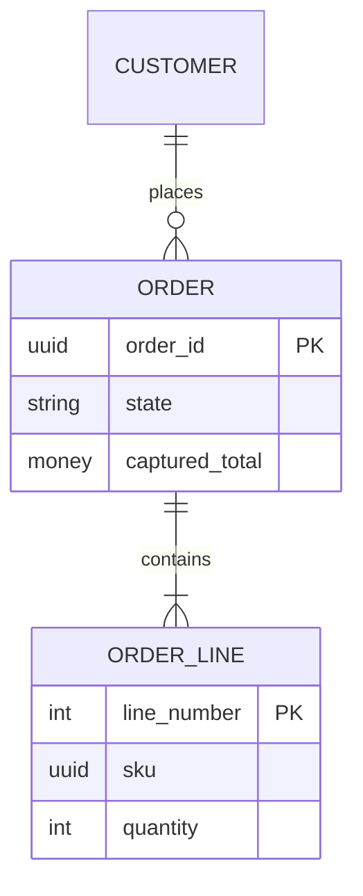

<!-- domain authoring skeleton (spec-objects-business). Fill every section with
     substantive content. Contract (manifest body_extraction asserts):
     - Frontmatter MUST carry id, title, artifact_type: domain.
     - "## Bounded Context" (H2, required): the context boundary and what it
       owns vs. what it delegates to neighbouring contexts. This is the
       domain object's kernel — the one thing only the domain FR can say.
     - "## Entities" (H2, OPTIONAL): a summary list only. Entities are
       first-class `entity` FRs linked from this domain via `contains`
       relationship edges; do not duplicate their definitions here. Pure
       grammar/protocol contexts may have no entities at all.
     - "## Entity Relationship Diagram" (H2, OPTIONAL): a mermaid diagram of
       the whole domain — valuable for human orientation when entities
       exist; extracted as `erd`.
     - "## Ubiquitous Language" (H2, optional): the shared vocabulary used by
       domain experts and code alike. -->
# [domain-001] Order Management

## Bounded Context

The Order Management context owns the lifecycle of a customer order from the
moment a cart is converted into an order until the order is shipped or
cancelled. It is the system of record for order state, order lines, and
captured totals. Pricing and tax computation belong to the Pricing context;
stock levels belong to the Inventory context; card authorisation belongs to
the Payments context. Order Management consumes those contexts through
published events and anti-corruption adapters and never reaches into their
data stores directly.

## Entities

- **Order** — aggregate root for a single customer purchase, identified by
  `order_id`; owns its order lines and enforces all order invariants.
- **OrderLine** — nested entity local to an Order, identified by
  `line_number` within its parent; never referenced from outside the
  aggregate.
- **Customer** — standalone entity identified by `customer_id`; referenced
  from Order by identity only.

## Entity Relationship Diagram

## Ubiquitous Language

- **Place** — convert a draft order into a binding purchase request.
- **Capture** — confirm payment for a placed order at the authorised amount.
- **Fulfilment** — the pick, pack, and ship work that completes a paid order.
- **Cancellation window** — the period during which a placed order may still
  be cancelled without compensation steps.
