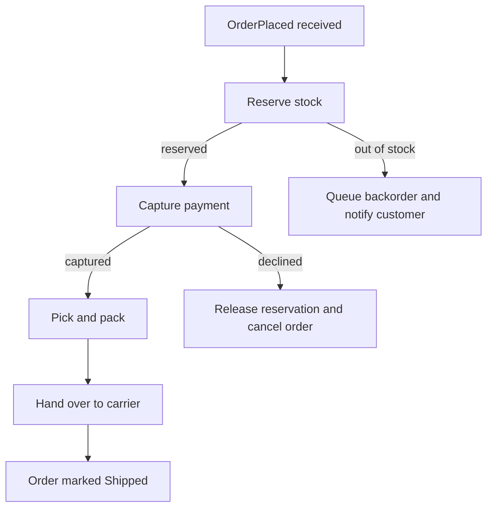
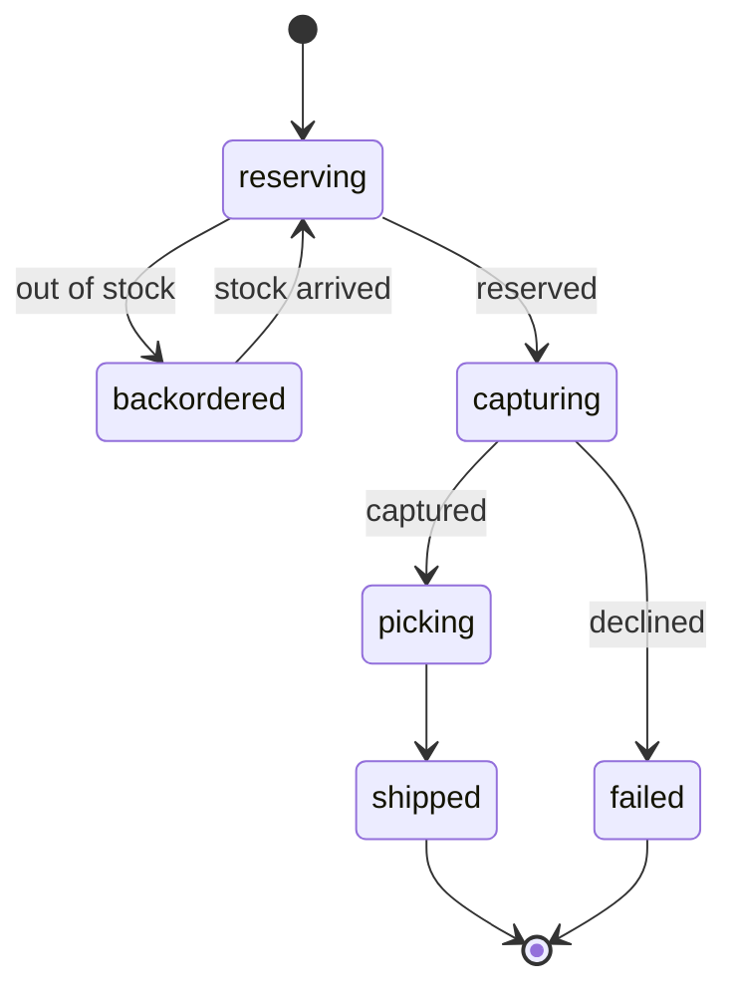

<!-- process authoring skeleton (spec-objects-business). Fill every section
     with substantive content. Contract (manifest body_extraction asserts):
     - Frontmatter MUST carry id, title, artifact_type: process.
     - "## Workflow" (H2, required) MUST contain a fenced code block with
       language `mermaid` diagramming the process flow. Multiple diagrams
       are kept (`multiple: true`) — split a complex flow into several
       smaller diagrams rather than forcing one oversized one.
     - "## States" (H2, OPTIONAL): mermaid state diagram(s) when the
       process carries an explicit state model (extracted as `states`).
     - "## Specification" and "## Algorithm" (H2) are optional prose
       elaborations of the diagram.
     - Mermaid hygiene: quote flowchart labels containing parentheses, no
       semicolons inside label text. -->
# [process-001] Order Fulfilment

Order Fulfilment is the long-running process that turns a placed order into a
shipped one. It reacts to OrderPlaced and coordinates Inventory, Payments,
and the warehouse.

## Workflow

## States

## Specification

The process is an event-driven saga keyed by `order_id`. Each step is
idempotent: redelivered events are detected via the step's recorded outcome
and skipped. Stock is reserved before payment capture so the customer is
never charged for unavailable goods. Compensation runs in reverse order — a
declined capture releases the reservation and cancels the order, emitting
OrderCancelled.

## Algorithm

1. On OrderPlaced, open a fulfilment record in state `reserving`.
2. Request stock reservation for every order line.
3. If any line cannot be reserved, move to `backordered`, notify the
   customer, and pause until stock arrives.
4. On successful reservation, request payment capture for `grand_total`.
5. If capture is declined, release the reservation, cancel the order, and
   close the record as `failed`.
6. On capture, dispatch a pick-and-pack job to the warehouse.
7. When the carrier confirms handover, mark the order `Shipped` and close
   the record as `completed`.
