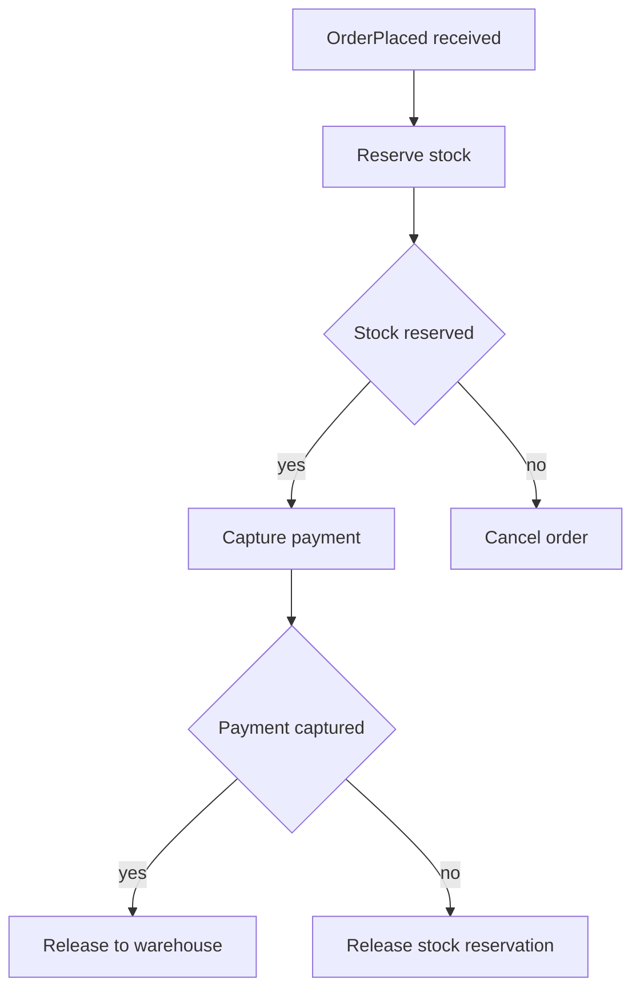
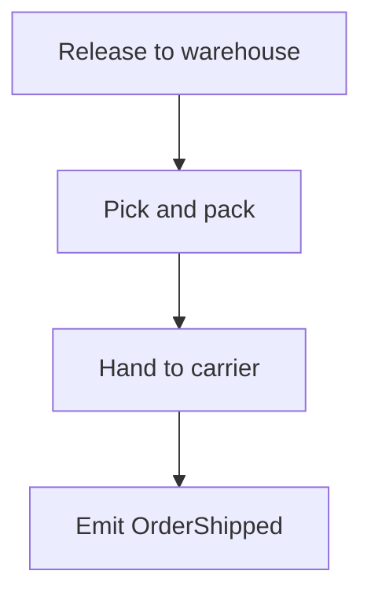
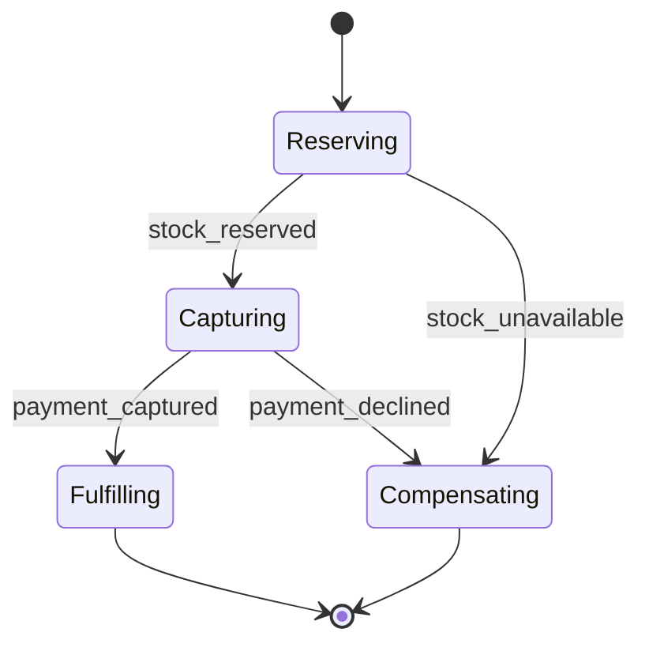

<!-- process authoring skeleton (spec-objects-business). Contract:
     - Frontmatter MUST carry id, title, type: process, object: process.
     - "## Properties" (H2): the process's typed fields; at least one carries
       `identity` — the correlation key that ties every step to one run.
     - "## Invariants" (H2): one `### <clauseId>` per clause.
     - "## Workflow" (H2, required) holds fenced `mermaid` diagrams
       (`multiple: true`) — split a complex flow into several smaller
       diagrams rather than one oversized one. Derived view of the typed
       declarations.
     - "## States" (H2, OPTIONAL): mermaid state diagram(s).
     - "## Specification" and "## Algorithm" (H2) are optional prose.
     - Mermaid hygiene: quote labels containing parentheses, no semicolons
       inside label text. -->
# [process-001] OrderFulfilment

OrderFulfilment is the long-running process that turns a placed order into a
shipped one. It reacts to OrderPlaced and coordinates Inventory, Payments,
and the warehouse.

## Properties

| Field | Type | Multiplicity | Constraints |
|---|---|---|---|
| correlation_id | UUID | 1..1 | identity |
| order_id | UUID | 1..1 | |
| started_at | Timestamp | 1..1 | |
| reservation_deadline | Duration | 1..1 | |
| compensated | Boolean | 1..1 | |

## Invariants

The clauses the OrderFulfilment declaration enforces. Each clause owns one
`ocl` fence under its own `### <clauseId>` heading; the fence text is carried
verbatim and never evaluated here.

### OneRunPerOrder

```ocl
context OrderFulfilment
inv OneRunPerOrder:
  OrderFulfilment.allInstances()->isUnique(r | r.order_id)
```

### CompensationFollowsAFailedCapture

```ocl
context OrderFulfilment
inv CompensationFollowsAFailedCapture:
  self.compensated implies self.captureFailed()
```

## Workflow


```mermaid
flowchart TD
    A[OrderPlaced received] --> B[Reserve stock]
    B --> C{Stock reserved}
    C -- yes --> D[Capture payment]
    C -- no --> E[Cancel order]
    D --> F{Payment captured}
    F -- yes --> G[Release to warehouse]
    F -- no --> H[Release stock reservation]
```


```mermaid
flowchart TD
    G[Release to warehouse] --> I[Pick and pack]
    I --> J[Hand to carrier]
    J --> K[Emit OrderShipped]
```

## States


```mermaid
stateDiagram-v2
    [*] --> Reserving
    Reserving --> Capturing: stock_reserved
    Reserving --> Compensating: stock_unavailable
    Capturing --> Fulfilling: payment_captured
    Capturing --> Compensating: payment_declined
    Fulfilling --> [*]
    Compensating --> [*]
```

## Specification

The process is correlated by `correlation_id` and is idempotent per
`order_id`: a duplicate OrderPlaced for an order already in flight is
discarded. `reservation_deadline` bounds how long stock may be held before
the run compensates.

## Algorithm

1. On OrderPlaced, start a run keyed by a fresh `correlation_id`.
2. Reserve stock for every line; on refusal, compensate and cancel the order.
3. Capture payment for `grand_total`; on decline, release the reservation.
4. Release the order to the warehouse and wait for the shipment confirmation.
5. Emit OrderShipped and close the run.
