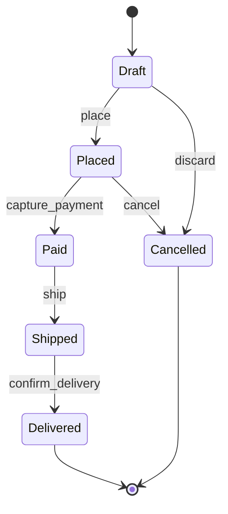

<!-- state_machine authoring skeleton (spec-objects-business). Fill every
     section with substantive content. Contract (manifest body_extraction
     asserts):
     - Frontmatter MUST carry id, title, artifact_type: state_machine.
     - "## States & Transitions" (H2, required) MUST contain a fenced code
       block with language `mermaid` holding a stateDiagram-v2 lifecycle.
     - Mermaid hygiene: no semicolons in transition labels, no spaces in
       state identifiers. -->
# [state-machine-001] Order Lifecycle

The Order aggregate moves through these states. Transitions are commands on
the aggregate root; every transition emits a corresponding domain event.

## States & Transitions

Only `Draft` orders may be edited. `cancel` is allowed until payment capture
succeeds. Once `Shipped`, the order is immutable and any remediation happens
through a separate Returns process.
