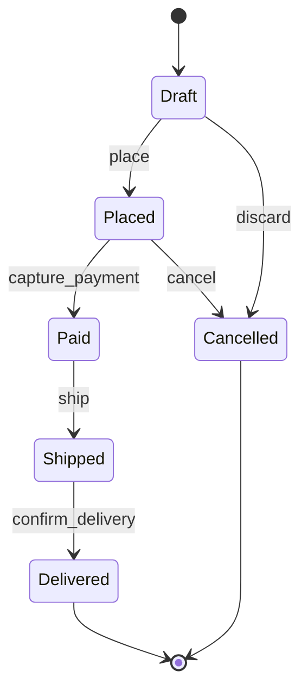

<!-- state_machine authoring skeleton (spec-objects-business). Contract:
     - Frontmatter MUST carry id, title, type: state_machine, object: state_machine.
     - "## Properties" (H2): the machine's context fields, in the same typed
       table form every other type uses.
     - "## Invariants" (H2): one `### <clauseId>` per clause.
     - "## Operations" (H2, required by StateMachine.json): one `### <name>`
       per transition command.
     - "## States & Transitions" (H2, required) holds a fenced `mermaid`
       stateDiagram-v2. It is a derived, human-facing view; the typed
       `## Operations` section is the authority for the command set.
     - Mermaid hygiene: no semicolons in transition labels, no spaces in
       state identifiers. -->
# [state-machine-001] OrderLifecycle

The Order aggregate moves through these states. Transitions are commands on
the aggregate root; every transition emits a corresponding domain event.

## Properties

| Field | Type | Multiplicity | Constraints |
|---|---|---|---|
| order_id | UUID | 1..1 | |
| current_state | OrderStatus | 1..1 | |
| entered_state_at | Timestamp | 1..1 | |

## Invariants

The clauses the OrderLifecycle declaration enforces. Each clause owns one
`ocl` fence under its own `### <clauseId>` heading; the fence text is carried
verbatim and never evaluated here.

### CancelIsAllowedUntilCapture

```ocl
context OrderLifecycle
inv CancelIsAllowedUntilCapture:
  self.current_state = OrderStatus::Paid implies not self.canCancel()
```

### ShippedIsImmutable

```ocl
context OrderLifecycle
inv ShippedIsImmutable:
  self.current_state = OrderStatus::Shipped implies self.pendingCommands()->isEmpty()
```

## Operations

The operations the OrderLifecycle declaration exposes. Each operation owns one
`### <name>` heading with an optional parameter table, a `Returns:` line
where it returns a value, and `Pre:`/`Post:` lines where it names clauses
declared in this artifact.

### place

Convert a draft order into a binding purchase request.

Pre: CancelIsAllowedUntilCapture

### discard

Abandon a draft order before it is placed.

### capture_payment

Confirm payment for a placed order at the authorised amount.

### cancel

Cancel a placed order before payment capture succeeds.

Pre: CancelIsAllowedUntilCapture

### ship

Hand the paid order to the carrier.

Post: ShippedIsImmutable

### confirm_delivery

Record the carrier's delivery confirmation.

## States & Transitions


```mermaid
stateDiagram-v2
    [*] --> Draft
    Draft --> Placed: place
    Draft --> Cancelled: discard
    Placed --> Paid: capture_payment
    Placed --> Cancelled: cancel
    Paid --> Shipped: ship
    Shipped --> Delivered: confirm_delivery
    Delivered --> [*]
    Cancelled --> [*]
```
