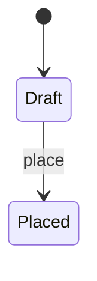

# [negative_009] OrderLifecycleWithStateDiagram

## Properties

| Field | Type | Multiplicity | Constraints |
|---|---|---|---|
| current_state | OrderStatus | 1..1 | |
| placed_at | Timestamp | 0..1 | |

## Invariants

### DraftOrderHasNoPlacementTime

```quire
self.current_state = OrderManagement::OrderStatus::Draft implies not present(self.placed_at)
```

## Operations

### place

Convert a draft order into a binding purchase request.

## States



## Transitions

| From | To | Trigger | Guard | Emits |
|---|---|---|---|---|
| Draft | Placed | place | | OrderPlaced |
