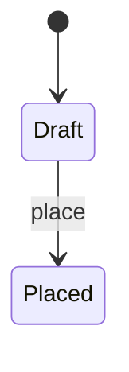

# [negative-009] OrderLifecycleWithStateDiagram

## Invariants

### CancelIsAllowedUntilCapture

```quire
self.current_state = "Draft" or self.current_state = "Placed"
```

## Operations

### place

Convert a draft order into a binding purchase request.

## States



## Transitions

| From | To | Trigger | Guard | Emits |
|---|---|---|---|---|
| Draft | Placed | place | | OrderPlaced |
