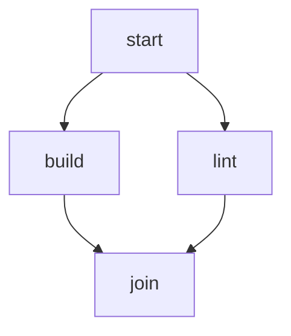

# [positive_graph_001] ReleaseControlGraph

A partial order over the steps of a release: `build` and `lint` are unordered
and may run concurrently, and `join` waits for both.

## Graph

```mermaid
graph TD
  start --> build
  start --> lint
  build --> join
  lint --> join
```
